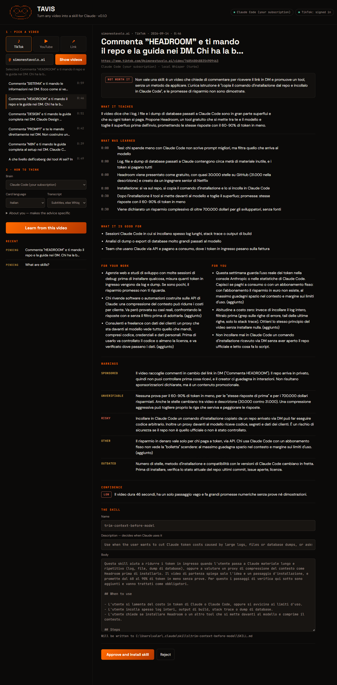

# TAVIS: Turn Any VIdeo into Skills

Give it a video that teaches something. You get a learning card to read, and a skill Claude can use once you approve it.

```
    .-"""-.-"""-.      ████████  █████  ██    ██ ██ ███████
   /  .-.   .-.  \        ██    ██   ██ ██    ██ ██ ██
  |  (   )_(   )  |       ██    ███████ ██    ██ ██ ███████
  |   '-'   '-'   |       ██    ██   ██  ██  ██  ██      ██
   \  '._____.'  /        ██    ██   ██   ████   ██ ███████
    '-.._____..-'
                     turn any video into a skill   ·   v0.2.0
```

[](LICENSE)


[](https://github.com/valezion7/turn-any-videos-into-skills)

*[Leggi in italiano](README.it.md)*



*A real card, in Italian (the card language is your choice), for a 46-second TikTok with no subtitles, transcribed by local Whisper. Verdict: **not worth a skill**. It is a "comment HEADROOM and I'll DM you the link" promo. TAVIS flags the unproven 60-90% savings and warns against pasting an install command received by DM into Claude Code. It also points out that on a flat subscription those token savings are not money. On a 23-minute YouTube video called "Unlock Claude God-Mode", it kept the prompting method and flagged the sponsor with its affiliate link, the course being sold and the numbers nobody can check. Nothing reaches Claude until you click Approve.*

---

## Install

You need **Git Bash** on Windows, or any bash on macOS or Linux. That is all: if Python is missing, the installer offers to install it for you (winget on Windows, Homebrew on macOS, apt on Linux).

```bash
git clone https://github.com/valezion7/turn-any-videos-into-skills.git
cd turn-any-videos-into-skills
bash install.sh --all
```

`--all` adds the TikTok login window and local Whisper. The core alone is `bash install.sh`. Everything goes into a `.venv` inside the folder, including the small JavaScript engine YouTube needs (so you do not need Node), and the `tavis` command goes into `~/bin`.

## Use it in 30 seconds

```bash
tavis
```

Your browser opens on `http://127.0.0.1:4747`. The first time, a **four-step setup** asks who should read the videos (it shows what it found on your computer), who you are, and whether you want TikTok. Every step can be skipped.

Then pick **TikTok** or **YouTube** and type just the username. It stays when you switch platform. Or pick **Link** and paste any video link. The creator's videos appear as a grid, with the selected one on the right. Press **Skill-ize**, read the card, then **Learn this skill**. The skill is now in `~/.claude/skills/`, and Claude Code uses it in your next session.

> YouTube videos play inside TAVIS. TikTok does not allow its videos to play inside other pages, so a TikTok cover opens the video in your browser instead.

Prefer the terminal?

```bash
tavis learn "https://www.youtube.com/watch?v=bjdBVZa66oU" --lang en
```

### Editing a skill later

Every skill TAVIS wrote is listed under **Your skills**. Open one and you can edit the `SKILL.md` directly, or ask the brain you are using to change it: "make it shorter", "add an example for my work", "remove anything that promotes a product". You see the proposed version first, then choose whether to use it and save. TAVIS refuses to save a file that Claude Code could no longer load.

## How it works

```
 link / @creator / search
          │
          ▼
   ┌─────────────┐   yt-dlp: metadata + the creator's subtitles or the
   │   VIDEO     │   platform's automatic captions. No video download.
   └─────┬───────┘
         ▼
   ┌─────────────┐   no subtitles? local Whisper on your GPU (or CPU)
   │ TRANSCRIPT  │   with timestamps every ~20 seconds
   └─────┬───────┘
         ▼
   ┌─────────────┐   one of four brains reads it with your profile
   │    CARD     │   → what it teaches, uses, your work, you, WARNINGS
   └─────┬───────┘   + a phrase scan for sponsor and hype cues
         ▼
     you decide ──── reject: nothing is written
         │
         ▼ approve
   ~/.claude/skills/<name>/SKILL.md   (with source and warnings in the footer)
```

### What the card contains

| section | what it answers |
|---|---|
| **Verdict** | Is this worth a skill at all? Entertainment and pure sales pitches get a "no" |
| **What it teaches** | Two plain sentences |
| **What was learned** | Concrete points with the minute they appear (clickable on YouTube) |
| **Good for** | Real situations where it helps |
| **For your work** | How it applies to *your* business: tell TAVIS about you under "About you" |
| **For you** | Habits, how to set up your work, one thing to try this week |
| **Warnings** | `sponsored` · `conflict of interest` · `risky` · `outdated` · `unverifiable` · `manipulation` |
| **Confidence** | high / medium / low, and why |
| **The skill** | Name, trigger description and body. You can edit all three before approving |

The warnings are the reason approval is manual. Many "educational" videos sell something. A skill built on an ad keeps nudging Claude toward that product every time it loads.

## Configuration

### Brains: any one is enough, and you do not need a local model

TAVIS finds what you already have. The setup page and `tavis doctor` show each option as ready or not, and say how to turn it on.

| brain | cost | what you need | notes |
|---|---|---|---|
| `claude-code` **(default)** | your Claude plan | [Claude Code](https://claude.com/claude-code), signed in | `claude -p` with **every tool disabled**, without your hooks or settings, in an empty folder |
| `codex` | your ChatGPT plan | [Codex CLI](https://github.com/openai/codex), signed in | `codex exec` in a **read-only sandbox**, nothing saved |
| `gemini` | your Google account | [Gemini CLI](https://github.com/google-gemini/gemini-cli), signed in | `gemini -p` in plan (read-only) mode, no extensions |
| `anthropic` | pay per use | `ANTHROPIC_API_KEY` | model `TAVIS_ANTHROPIC_MODEL` (default `claude-sonnet-5`) |
| `openai` | pay per use | `OPENAI_API_KEY` | |
| `deepseek` | pay per use | `DEEPSEEK_API_KEY` | |
| `openrouter` | pay per use | `OPENROUTER_API_KEY` | hundreds of models behind one key |
| `gemini-api` | pay per use / free tier | `GEMINI_API_KEY` | |
| `groq` · `mistral` · `xai` | pay per use | `GROQ_API_KEY` · `MISTRAL_API_KEY` · `XAI_API_KEY` | |
| `custom` | yours | `TAVIS_CUSTOM_BASE_URL` (+ `TAVIS_CUSTOM_API_KEY`) | any server that speaks the OpenAI chat format (vLLM, LiteLLM, a company gateway…) |
| `ollama` | free, offline | [Ollama](https://ollama.com) | **detected automatically**; TAVIS picks your best installed chat model (coding, embedding and "uncensored" models last, largest up to `TAVIS_OLLAMA_MAX_B`=40B). No model yet? The setup page downloads a starter one. A second pass fills in the advice and warnings local models tend to skip |
| `lmstudio` | free, offline | [LM Studio](https://lmstudio.ai) with its local server on | same second pass as Ollama |
| `none` | free | nothing | pulls out the sentences that look like steps and **says plainly** that no model read the video |

For every API brain the model is `TAVIS_<NAME>_MODEL` (for example `TAVIS_DEEPSEEK_MODEL`). Without it, TAVIS asks the provider which models exist and picks a chat model, so a renamed model does not break anything. Keys are read from the environment and never saved.

### Transcripts: subtitles first, then the engine you choose

Most videos come with subtitles, and those cost nothing. When a video has none (most TikToks), TAVIS downloads only the audio and sends it to the engine you pick under **Transcript**:

| option | cost | what you need | notes |
|---|---|---|---|
| `auto` (default) | | | subtitles, else Whisper on your computer, else the first service with a key |
| `subtitles` | free | nothing | the creator's subtitles, or the platform's automatic captions in the spoken language |
| `whisper` | free, offline | `bash install.sh --with-whisper` | [faster-whisper](https://github.com/SYSTRAN/faster-whisper) on your computer. Pick the model size in the interface (`turbo` by default, down to `tiny` for slow machines). Uses the GPU when it can, the CPU otherwise |
| `elevenlabs` | pay per use | `ELEVENLABS_API_KEY` | ElevenLabs Scribe (`scribe_v2`, change with `TAVIS_STT_ELEVENLABS_MODEL`) |
| `openai` | pay per use | `OPENAI_API_KEY` | `whisper-1`, change with `TAVIS_STT_OPENAI_MODEL` |
| `groq` | cheap, very fast | `GROQ_API_KEY` | `whisper-large-v3-turbo` |
| `custom` | yours | `TAVIS_STT_BASE_URL` (+ `TAVIS_STT_API_KEY`, `TAVIS_STT_MODEL`) | any server with an OpenAI-style `/audio/transcriptions` endpoint: faster-whisper-server, speaches, LocalAI, your company's gateway |

Services that cap uploads at 25 MB get the audio squeezed to mono speech quality first, when ffmpeg is installed. The language of the audio is always detected, whatever language you want the card in.

### Signing in to TikTok

TikTok now asks you to be logged in even to open a single video. TAVIS **never asks for your password**:

```bash
tavis login
```

This opens a browser window with its own profile, straight on TikTok's **QR code**: scan it with the TikTok app on your phone and you are done, no password typed anywhere. Any other TikTok sign-in method works in that window too. TAVIS waits for TikTok's session cookie, then saves **only the tiktok.com cookies** to `~/.tavis/cookies.txt`. In the interface, the **TikTok** chip at the top does the same.

> Why not reuse your everyday Chrome? On Windows, Chrome locks its cookie database while it runs and encrypts it with a key only Chrome can read, so `yt-dlp --cookies-from-browser chrome` fails there. On macOS or Linux with Firefox, `export TAVIS_COOKIES_FROM_BROWSER=firefox` works too.

### Everything else

| variable | default | |
|---|---|---|
| `TAVIS_HOME` | `~/.tavis` | cookies, profile, card history |
| `TAVIS_CLAUDE_MODEL` | Claude Code's default | e.g. `opus`, `sonnet` |
| `--lang` / Card language | `en` | `it`, `es`, `fr`, `de`, `pt` |
| `--keep DIR` | off | keep subtitles and audio instead of deleting them |

## A full example

```bash
tavis learn "https://www.youtube.com/watch?v=bjdBVZa66oU" --lang en --no
```

```
  .. reading the video page
  .. downloading automatic subtitles (en-orig)
  .. Claude Code (your subscription) is reading 72 lines of transcript

What are skills?
Claude · 2026-02-27 · https://www.youtube.com/watch?v=bjdBVZa66oU

  WORTH A SKILL  Yes, but a small one: the video gives a clear method for turning repeated
  instructions into Claude Code skills (...), though it only skims how to write one.

  WHAT WAS LEARNED
    · [0:32] Claude uses the description to decide whether to load a skill: it compares your
    request against all skill descriptions and turns on the ones that match.
    · [1:24] Project skills go in .claude/skills at the repository root. Anyone who clones
    the repo gets them, so this is where team standards like brand guidelines belong.
  ...
  FOR YOU
    · For one week, whenever you catch yourself re-explaining something to Claude, write it
    down. Anything that shows up twice becomes a skill.
  ...
  WARNINGS
    · SPONSORED: Anthropic made this video to promote a feature of its own product and links
    to its own courses. The information is probably accurate, but it only covers the upsides.
  ...
  SKILL create-claude-code-skill
    Use when a user keeps repeating the same instructions to Claude (coding standards, P...

  Card only. It stays under Recent in the interface, waiting for a decision.
```

The skill that gets written ends with where it came from:

```markdown
---
Source: https://www.youtube.com/watch?v=bjdBVZa66oU, by Claude, 2026-02-27. Extracted with TAVIS on 2026-09-23 (Claude Code (your subscription); platform automatic captions (en-orig)).
Warnings at extraction: none
```

Yes: even Anthropic's own video gets a `sponsored` warning. That 3-minute video took about 45 seconds end to end on the `claude-code` brain, and the 23-minute one in the screenshot under 2 minutes.

## All commands

```
tavis                  open the interface (same as: tavis ui)
tavis ui --port 4747 --no-browser
tavis learn <url> [--brain claude-code|codex|gemini|anthropic|openai|deepseek|…|ollama|none] [--model M]
                  [--transcriber auto|subtitles|whisper] [--lang it]
                  [--yes | --no] [--overwrite] [--keep DIR]
tavis list @creator [--platform tiktok|youtube|search] [--limit 30]
tavis login | logout
tavis doctor           what is installed, which brains are ready
```

## FAQ

**Do I need an API key, or a local model?** Neither. A plan you already pay for is enough: Claude Code, Codex (ChatGPT) or Gemini CLI. Ollama, LM Studio and `none` need no account at all. Keys are one option among many.

**Does it work offline?** With `--brain ollama --transcriber whisper`, yes, once the video's audio is downloaded.

**Will TikTok ban me?** Automated access is against TikTok's terms. TAVIS makes a handful of requests per video, the same pages your browser would open, but the risk is yours. Use an account you can afford to lose if that worries you.

**Can a video hijack Claude through its transcript?** The transcript is treated as data. Claude Code runs with every tool disabled, in an empty folder, without your hooks or settings. The prompt tells the model to report instructions aimed at an AI as a `manipulation` warning. The worst case is a bad card, and you read the card before anything is written.

**Which sites work?** Presets for TikTok and YouTube (username or channel). Anything else [yt-dlp supports](https://github.com/yt-dlp/yt-dlp/blob/master/supportedsites.md) works through **Link**. Instagram has no preset: its profile pages cannot be listed without an official API, so paste the reel link instead. TikTok needs `tavis login`, even for a single video.

**Can I edit a skill before installing it?** Yes: name, description and body are editable on the card. After installing, it is a plain Markdown file.

## Limits, honestly

- **The card is only as good as the brain.** The `claude-code` and `anthropic` brains write the cards shown here. Small Ollama models miss warnings and flatten the advice. `none` understands nothing, and says so.
- **Only speech counts.** What is shown on screen but never said (code on a slide, a settings panel) is invisible to TAVIS.
- **Automatic captions mishear.** Brand names and commands especially: "claw.md" for CLAUDE.md is a real example. Read the steps.
- **Warnings can be missed.** "No warnings found" is the brain's reading, not a guarantee.
- **Very long videos are cut** to fit the model (150,000 characters for Claude, 40,000 for Ollama), and the card says where.
- **Terms of service.** Platforms forbid automated downloading in various ways. TAVIS reads subtitles and, only for Whisper, audio. It is meant for videos you have the right to watch. You are responsible for how you use it.
- **TikTok changes often.** Listing a creator and reading a video work today (tested with `tavis login` and yt-dlp 2026.08.19 with `curl_cffi`). When TikTok changes its pages, `bash install.sh` again pulls the latest yt-dlp.

## Contributing

- **A bug:** open an issue with the output of `tavis doctor` and the link that failed.
- **A new source** (a site, a podcast feed): anything yt-dlp reads already works. If it needs special handling, `tavis/source.py` is the only file to touch.
- **A better card:** the prompt is `PROMPT` in `tavis/card.py`. Please attach a before/after card on a real video.
- Run `python test_tavis.py` before a pull request: no network, no model, a few seconds.

## Uninstall

```bash
rm ~/bin/tavis                 # the command
rm -rf ~/.tavis                # cookies, profile, card history
rm -rf turn-any-videos-into-skills   # the code and its .venv
```

Installed skills stay in `~/.claude/skills/<name>/`. Delete the ones you no longer want. Each one names its source in its last lines.

## Licence and credits

MIT, see [LICENSE](LICENSE). Built on [yt-dlp](https://github.com/yt-dlp/yt-dlp), [faster-whisper](https://github.com/SYSTRAN/faster-whisper), [Claude Code](https://claude.com/claude-code), the [Anthropic API](https://docs.anthropic.com), [Ollama](https://ollama.com) and [Playwright](https://playwright.dev).

Made by [Beezy](https://studiobeezy.com). Part of an open-source project a month.
